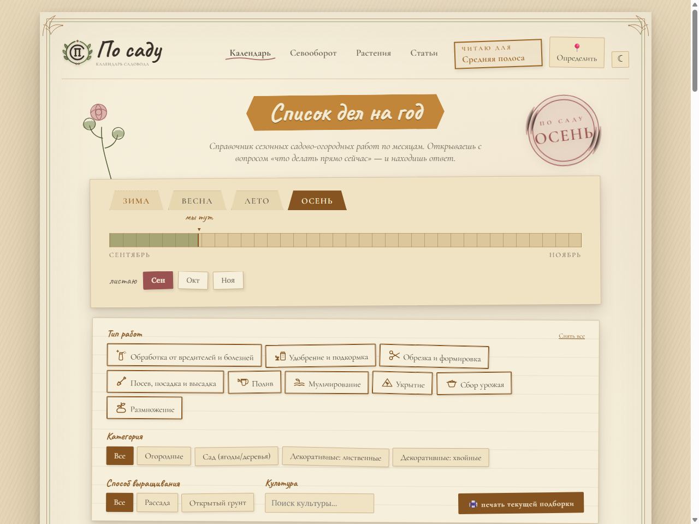
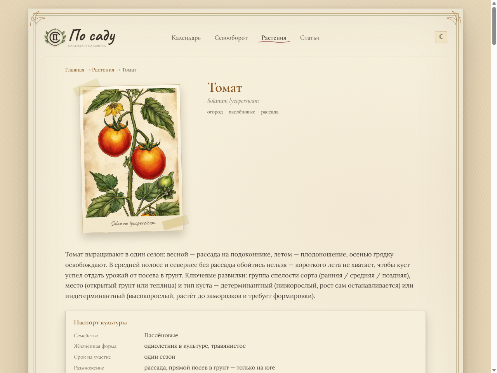

# По саду — календарь садовода

Витрина проекта [posadu.ru](https://posadu.ru): сайт-справочник сезонных садово-огородных работ и ежемесячный дайджест в Telegram-каналах по региону. Разработан и сопровождается через Claude Code.



## Проблема

У садоводов нет под рукой понятного ответа на вопрос «что делать на участке прямо сейчас» — рекомендации либо общие («сажать весной»), либо разбросаны по десяткам форумов и статей без привязки к региону и текущей погоде.

## Пользователь

Дачники и садоводы-любители, которые ведут участок в одном из четырёх регионов: средняя полоса, юг, Урал-Сибирь, северо-запад.

## Основная функция

- **Календарь работ** — на вход месяц/регион/тип работы, на выход список актуальных садово-огородных дел с сортировкой по декадам
- **Справочник растений** — полный цикл ухода за культурой (посадка → полив → подкормки → защита → зимовка → удаление) для 100+ культур
- **Севооборот** — подсказки по совместимости и чередованию культур на грядке
- **Telegram-каналы** — общий + 4 региональных канала, ежемесячный дайджест актуальных работ по региону без личной подписки

## Формат результата

Статический сайт (календарь, карточки растений, статьи об агротехнике) + 5 Telegram-каналов, в которые раз в месяц публикуется дайджест работ по региону.

## Минимальный функционал (реализовано)

- Календарь работ с фильтрами по типу, культуре, способу выращивания — 4 региона
- Справочник растений с единой структурой карточки для каждой культуры
- Статьи об агротехнике
- Ежемесячная публикация дайджеста в Telegram-каналы (общий канал-анонс + 4 региональных)

**Планируется:** расширение справочника, персонализация календаря под конкретный участок.

## Технологии

- **Сборка сайта** — Node.js, данные ведутся в едином `garden-data.xlsx` и собираются в статику (`docs/build/*.js`): HTML, JSON, минифицированный бандл
- **Фронтенд** — ванильный JS/CSS, без фреймворка
- **Публикация в Telegram** — Cloudflare Worker (`worker/index.js`), постит дайджест напрямую в каналы; личных подписок не хранит (сознательный отказ ради приватности — раньше бот вёл рассылку по личным подпискам в Cloudflare KV)
- **CI** — GitHub Actions (ежемесячная рассылка, пересборка снапшота, smoke-check деплоя)
- **Хостинг сайта** — статический хостинг, деплой по push в ветку `master`

## Скриншот: карточка растения



## Как запустить локально

Сборка сайта из данных:

```bash
cd docs/build
npm install
npm run build:all   # календарь, растения, севооборот, регионы, статьи, sitemap
```

Результат — статика в `docs/`, её можно открыть напрямую в браузере или раздать любым статическим сервером.

Локальный запуск воркера (Cloudflare Worker):

```bash
cd worker
npx wrangler dev
```

Для полноценной публикации в каналы нужны свои `TELEGRAM_BOT_TOKEN`, `CRON_SECRET`, `TELEGRAM_WEBHOOK_SECRET` (заводятся через `wrangler secret put`) и свой KV namespace — реальные идентификаторы из продакшена в этом репозитории не публикуются.

## Скилл проекта

В `.claude/skills/` — 5 готовых скиллов для Claude Code, которые автоматизируют сопровождение проекта:

| Скилл | Что делает |
|---|---|
| `garden-calendar-edit` | Правка данных календаря (`garden-data.xlsx`) через пайплайн исследователь → агроном → редактор → пересборка |
| `garden-article` | Написание/обновление статьи об агротехнике через мультиагентный пайплайн (исследование → проверка фактов → текст → иллюстрация → редактура → сборка) |
| `garden-weekly-topic` | Еженедельно сам находит тему статьи по обсуждаемости у дачников и прогоняет её через пайплайн `garden-article` |
| `garden-release` | Коммит и публикация изменений сайта |
| `garden-social-post` | Подготовка поста для соцсетей на основе статьи |

Каждый скилл — это не просто инструкция, а пайплайн из нескольких специализированных субагентов (`.claude/agents/`; например, для правки календаря: сначала поиск и подтверждение агротехнических фактов минимум по двум источникам, затем сверка с климатической базой по регионам, и только потом — правка данных).

## Структура репозитория

```
docs/            — сайт: HTML/CSS/JS, сгенерированные данные, статьи, карточки растений
docs/build/       — Node-скрипты сборки статики из garden-data.xlsx
docs/*-src/       — исходники статей и карточек растений (Markdown)
worker/           — Cloudflare Worker: публикация дайджеста в Telegram-каналы
.claude/skills/   — скиллы Claude Code для сопровождения проекта
.claude/agents/   — субагенты, из которых собраны пайплайны скиллов
garden-data.xlsx  — единый источник данных календаря
```

---

Этот репозиторий — публичная витрина основного (закрытого) проекта. Закрытый репозиторий остаётся приватным: в нём — внутренние рабочие документы и историческое состояние хранилища времён личных подписок на бота, ещё не вычищенное вручную после перехода на каналы.
